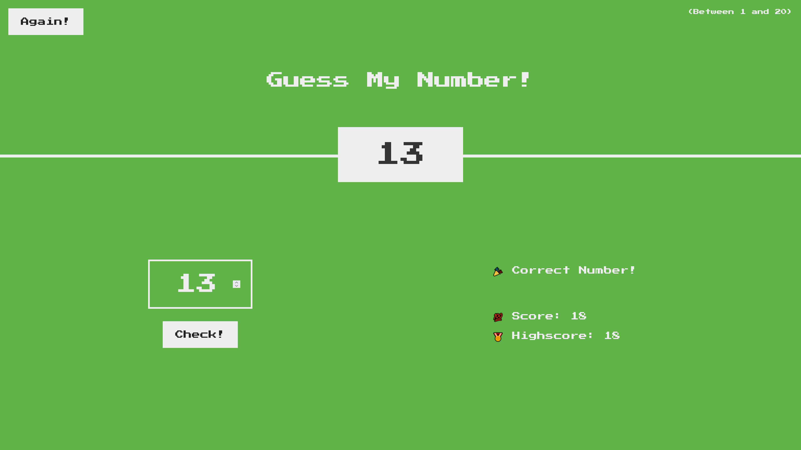

# Guess My Number

This is a simple number guessing game developed as part of Jonas Schmedtmann's JavaScript course. The player has to guess a number between 1 and 20, and the game provides feedback on whether the guess is too high, too low, or correct.

## Table of Contents

- [Project Overview](#project-overview)
- [Features](#features)
- [Technologies Used](#technologies-used)
- [Usage](#usage)

## Project Overview

"Guess My Number" is a fun and interactive guessing game where the user tries to guess a secret number between 1 and 20. The game provides feedback on the guesses and keeps track of the user's score and high score.

## Features

- Randomly generated secret number between 1 and 20.
- User input to guess the number.
- Feedback on whether the guess is too high, too low, or correct.
- Score tracking for the current game.
- High score tracking across games.

## Technologies Used

- HTML5
- CSS3
- JavaScript

## Usage

1. **Open the game in your web browser:**

   - After setting up the project, navigate to the project directory and open `index.html` in your preferred web browser.

2. **Enter a guess:**

   - You will see an input field where you can enter a number between 1 and 20.

3. **Submit your guess:**

   - Click the "Check!" button to submit your guess.

4. **Receive feedback:**

   - The game will provide feedback on whether your guess is too high, too low, or correct.
     - If your guess is too high, you will see a message indicating it is too high.
     - If your guess is too low, you will see a message indicating it is too low.
     - If your guess is correct, you will see a congratulatory message and the background color of the game will change to indicate you have won.

5. **Track your score:**

   - The game keeps track of your score, which decreases by one point for each incorrect guess.
   - The current score is displayed on the screen.

6. **High score tracking:**

   - The game also keeps track of the highest score achieved, which is updated whenever you set a new high score.

7. **Start a new game:**

   - Click the "Again!" button to reset the game and start a new round with a new secret number.
   - The score and the input field will be reset, but the high score will be retained.

8. **Play again:**
   - Repeat the steps to keep playing and try to beat your high score.
